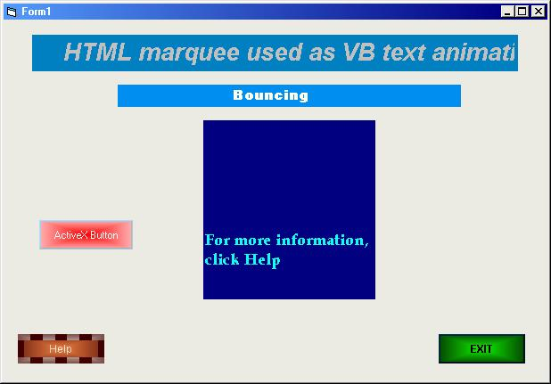



## HTML buttons and marquee \( use as VB activeX control button and text animation\)

### Description

This code is an activex control button and text animation. I use HTML button and marquee. I use HTML button because in HTML you can make many kinds of good looking button very easy, combine with my knowledge in VB I intergate the two. At first I thought it was impossible but I did it.

The only little problem with this is that, it is a bit slow while loading. But if everything is aready loaded, it will run very smooth.

If you DO NOT like my work please DO NOT vote for me.

Thanks...
 
### More Info
 

             |
---                |---
**Submitted On**   |2003-09-10 12:50:54
**By**             |[Marshall Greg R\. Poyaoan a\.k\.a "Pinoy Ako\!"](https://github.com/Planet-Source-Code/PSCIndex/blob/master/ByAuthor/marshall-greg-r-poyaoan-a-k-a-pinoy-ako.md)
**Level**          |Intermediate
**User Rating**    |5.0 (15 globes from 3 users)
**Compatibility**  |VB 6\.0
**Category**       |[Internet/ HTML](https://github.com/Planet-Source-Code/PSCIndex/blob/master/ByCategory/internet-html__1-34.md)
**World**          |[Visual Basic](https://github.com/Planet-Source-Code/PSCIndex/blob/master/ByWorld/visual-basic.md)
**Archive File**   |[HTML\_butto1643839102003\.zip](https://github.com/Planet-Source-Code/marshall-greg-r-poyaoan-a-k-a-pinoy-ako-html-buttons-and-marquee-use-as-vb-activex-control__1-48394/archive/master.zip)

